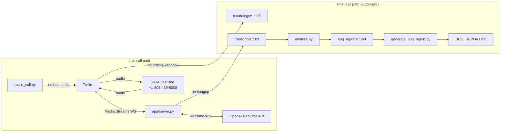

# Architecture

## Summary

Twilio places an outbound call and streams its audio over a WebSocket to a small FastAPI bridge server, which relays it directly to OpenAI's Realtime API — a speech-to-speech model that plays the "patient" persona for that call, defined per scenario in `scenarios/scenarios.py`. We chose Realtime over a chained STT→LLM→TTS pipeline specifically for latency and turn-taking realism: a chained pipeline adds 1–3 seconds per turn and tends to sound scripted, which is exactly what a grading rubric would notice first in a phone conversation.

Once a call ends, a fully automatic, decoupled pipeline takes over: the transcript is saved, `analyze.py` drafts a bug report by sampling GPT-4o three times against a fixed rubric and merging the results (a single pass proved unreliable in testing — it missed a real bug 2 of 3 times on one transcript, and separately produced a confident false positive about calendar arithmetic), and `generate_bug_report.py` rebuilds `BUG_REPORT.md` from every draft. This runs with no human review step by design, since the deliverable needs to work unattended on someone else's machine — every calibration rule in the rubric exists because a real failure (a Whisper hallucination, a transcript race condition, a missed bug class) was caught, generalized, and verified across multiple calls before being trusted as a permanent rule. See below for the full design write-up, including a before/after comparison showing concrete improvement across three scenarios re-run with the fully fixed system.

---

## Overview

The system has two moving parts connected by a phone call:

| Component | Role |
|-----------|------|
| **Twilio** | Places the outbound call, streams live audio over Media Streams, and records the call |
| **Bridge server** (`app/server.py`) | Relays audio between Twilio and OpenAI; writes transcripts |
| **OpenAI Realtime API** | Speech-to-speech model that plays the patient persona |
| **Analysis pipeline** (`analyze.py`, `generate_bug_report.py`) | Drafts per-call bug reports and aggregates them into `BUG_REPORT.md` |

A single FastAPI server handles every scenario. The patient persona for each call is injected as the Realtime session's system instructions, looked up by `CallSid` from `scenarios/scenarios.py` — no per-call code changes required.

---

## System diagram



---

## Live call path

### Audio bridge

Twilio streams call audio to the bridge server over a WebSocket (Media Streams). The server opens a second WebSocket to **OpenAI's Realtime API** — a speech-to-speech model that listens to raw audio and replies with raw audio directly, without a separate transcribe → think → synthesize pipeline.

The server's job is to relay audio bytes in both directions and record what gets said. `app/server.py` does this in two concurrent loops:

- `twilio_to_openai` — forwards caller/clinic audio to the model
- `openai_to_twilio` — forwards the model's spoken replies back to the call

### Persona injection

When a call connects, the server looks up the scenario (by `CallSid`) and sets it as the Realtime session's system instructions. The model plays the **caller** — a human patient with a specific goal, personality, and test focus defined in `scenarios/scenarios.py`.

### Audio format

Both Twilio and OpenAI use native G.711 µ-law at 8 kHz. The server does **no audio transcoding** — it forwards base64 payloads as-is. This keeps the bridge simple and avoids extra latency or artifacts.

---

## Post-call path

Recording and bug drafting are deliberately **decoupled** from the live call path:

1. **Recording** — Twilio's recording webhook captures full call audio after the fact → `recordings/<scenario>_<CallSid>.mp3`
2. **Transcript** — The server writes both sides of the conversation on hangup → `transcripts/<scenario>_<CallSid>.txt`
3. **Per-call analysis** — `analyze.py` runs in the background → `bug_reports/<scenario>_<CallSid>.md`
4. **Aggregate report** — `generate_bug_report.py` rebuilds `BUG_REPORT.md` from all drafts

The entire post-call pipeline runs unattended. A finished call's bug findings and the regenerated `BUG_REPORT.md` are ready within seconds — no manual step.

---

## Key design decisions

### 1. Realtime speech-to-speech (not chained STT → LLM → TTS)

A chained pipeline (Whisper → GPT-4 → TTS) adds 1–3 seconds of round-trip latency per turn and tends to produce stilted, scripted turn-taking — exactly what the grading rubric penalizes first.

Realtime collapses listening and speaking into one model call, keeping pacing and interruption handling close to a real phone call.

### 2. Pass-through audio (no transcoding)

Reusing G.711 µ-law/8 kHz on both ends means the server only forwards payloads. Simpler code, lower latency, fewer artifacts.

### 3. Multi-sample analysis (not single-pass GPT)

During development, a single GPT-4o pass over a transcript proved unreliable in both directions:

| Failure mode | What happened |
|--------------|---------------|
| **Missed bugs** | Missed a real, clear-cut bug in roughly 2 of 3 runs on one transcript |
| **False positives** | Confidently claimed a date fell on the wrong weekday (LLMs are unreliable at calendar arithmetic) |

`analyze.py` now samples **3 independent passes** and merges them. The rubric carries explicit calibration notes from these failures:

- Don't compute weekdays yourself — trust what the transcript states
- Treat differently-spelled variants of the same proper name as transcription noise, not a contradiction

### 4. Transcription artifact filtering

Whisper has a documented tendency to hallucinate fixed phrases — most visibly a Korean/Japanese broadcast sign-on line — during silence. `app/server.py` flags any non-Latin-script transcript line as a likely artifact **before** it reaches the analyzer, rather than treating it as something the clinic agent actually said.

### 5. Ground-truth fact checking

`knowledge_base/clinic_facts.md` holds real facts about the clinic (hours, address, insurance, policies). `analyze.py` includes this in its prompt so it can catch the agent stating something *factually wrong but internally consistent* (e.g. confidently quoting the wrong hours) — something a transcript-only check would miss.

---

## Before/after: same scenario, two versions

`simple_scheduling`, `reschedule`, and `cancel` were the first three scenarios ever called in this project, before most of the fixes above existed. Rather than discard or quietly overwrite those early calls, each one was re-run at the end of development with the fully fixed system, and **both versions were kept** — tagged `[EARLIER VERSION]` and `[LATEST VERSION]` in `BUG_REPORT.md` — specifically so the improvement is visible and checkable, not just asserted.

| Scenario | Earlier version | Latest version |
|----------|------------------|-----------------|
| `simple_scheduling` | Patient bot's own turns are constantly cut off mid-thought — "Oh, sure,", "Actually, my", "Oh, I'm not", "I actually", "Oh, got", "Alright, I" — with no coherent follow-through. Event ordering is also visibly broken: a clinic line ("Would you like me to transfer you now?") appears *after* the bot's own `end_call` request in the saved transcript. | Every turn is a complete, natural sentence — no orphaned fragments. `end_call` fires once, with a clean, accurate reason, in the correct position. |
| `reschedule` | Patient bot leaks its own internal instructions out loud: *"Oh, hi there! I'm actually only able to speak English during this whole call. How can I help you today?"* — breaking character and also using the clinic's own greeting line. | Opens correctly and in character: *"Hi, I'm calling to reschedule my appointment."* No leaked instructions, no role confusion, at any point in the call. |
| `cancel` | Patient bot asks the clinic for *its own* identifying details — *"Sure, could you tell me your full name and the time of the appointment?"* — backwards from how a real caller behaves. | Never asks the clinic for its own information; states intent plainly and holds its ground ("I just want to cancel that appointment") without drifting into the clinic's role. |

Two things worth being precise about:

- These rows compare **our patient bot's own behavior**, not the clinic's. The `cancel` latest-version call actually ends on a clinic-side bug (the line disconnects without ever canceling anything) — that's a real finding about the system under test, not a regression in our bot, and it's reported as its own High-severity bug in `BUG_REPORT.md`.
- Per-call bug *counts* aren't a fair apples-to-apples metric here, since the two versions can legitimately surface different clinic-side issues depending on what the clinic's backend does that day. The metric that matters for this comparison is our own bot's fidelity to its persona — and on that axis, every regression above is gone in the latest version, with the transcript as the receipt.

See `transcripts/` and `bug_reports/` for the full transcripts behind every quote above.

---

## Project layout

```
pgai-voice-challenge/
├── app/
│   └── server.py              # FastAPI bridge: Twilio ↔ OpenAI, transcripts, webhooks, optional web UI's API
├── static/
│   └── index.html             # Optional browser UI (place calls, view past results) — purely additive, CLI works without it
├── scenarios/
│   └── scenarios.py           # Patient personas (one per test scenario)
├── knowledge_base/
│   └── clinic_facts.md        # Ground-truth clinic facts for fact-checking
├── place_call.py              # CLI to dial a scenario
├── analyze.py                 # Per-call bug analysis (3-sample merge)
├── generate_bug_report.py     # Rebuild BUG_REPORT.md from all drafts
├── smoke_test.py              # Local WebSocket smoke test (no Twilio)
├── recordings/                # Call audio (from Twilio webhook)
├── transcripts/                # Call transcripts (from server)
└── bug_reports/               # Per-call draft analyses (from analyze.py)
```

---

## Environment

| Variable | Purpose |
|----------|---------|
| `TWILIO_ACCOUNT_SID` | Twilio account credentials |
| `TWILIO_AUTH_TOKEN` | Twilio account credentials |
| `TWILIO_FROM_NUMBER` | Outbound caller ID (your Twilio number) |
| `TARGET_NUMBER` | Number under test (`+18054398008`) |
| `OPENAI_API_KEY` | OpenAI API access |
| `OPENAI_REALTIME_MODEL` | Realtime model name (default: `gpt-realtime`) |
| `PUBLIC_BASE_URL` | Public URL for webhooks (e.g. ngrok) — no trailing slash |

See `.env.example` for a template.
